***
# **Summary**
***
**Motivation:** Integrate mechanics and PCB design to create something fun and engaging. 

In Spring 2022 I joined a UC Berkeley PCB focused Decal. This student-run class gave us the opportunity to learn how to create custom PCBs and use them for projects. For the final project, my group decided that we wanted to use the PCB to power some kind of small robotic contraption. Our final design was a pair of 3d printed eyes that were capable of blinking and looking at the face of the nearest person.  The eyes were modeled using TinkerCAD, the PCB was fully designed by us in KiCAD and manufactured in China, and the servos were controlled by an ESP32-CAM microcontroller. I programmed the microcontroller using Arduino, and was able to succesfully get a Webserver running by using the microcontroller as an access point. The webserver allowed me to see what the camera saw and fine-tune the facial recognition and tracking. The camera was able to locate the position of a face, and I used this position to control the position of the servos accordingly. This allowed the eyes to follow a face as they moved around.

***
## **Full Process**
***
The final project consists of: 
    
    Custom Made PCB 
    Custom 3D printed Eyes 
    6 servos 
    ESP32-CAM 
    Supply voltage, from a wall plug or a LiPo Battery 
    Photoresistors
    Test LED to check that voltage is correctly stepped down  

## **_Designing the circuit board_**
The first step was to design the actual PCB that we would be using for this project. We created schematics for the different electrical components that we required, and then combined them together for the final circuit board design.

_Voltage Input from Wall Plug and LiPo Battery, respectively_
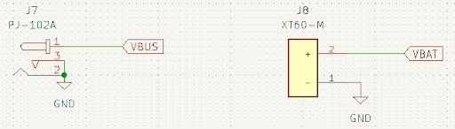

_Battery Switch / Regulator to switch between the different voltage sources_
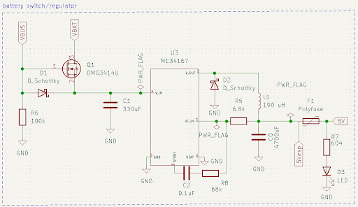

_Circuit to power MicroController and connect I/O ports_
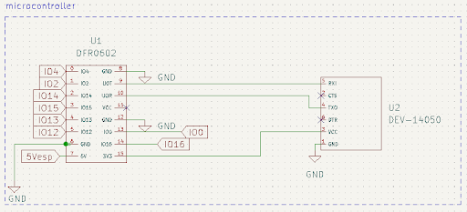

_Photoresistors Circuit_
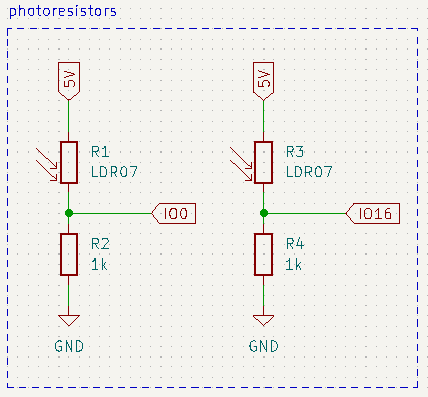

_Servos Circuit_
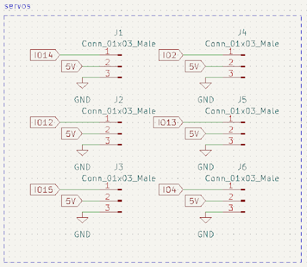

_Combined Final PCB Layout_
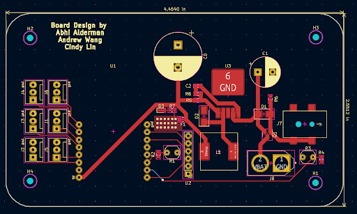

## **_Assembling the circuit board_**
After getting the PCB printed and shipped to us, and receiving the electrical parts, we had to assemble all the electrical components to the the board itself. This took a lot of soldering, which was especially difficult with how small some of these components were. 

_Base Circuit Board_
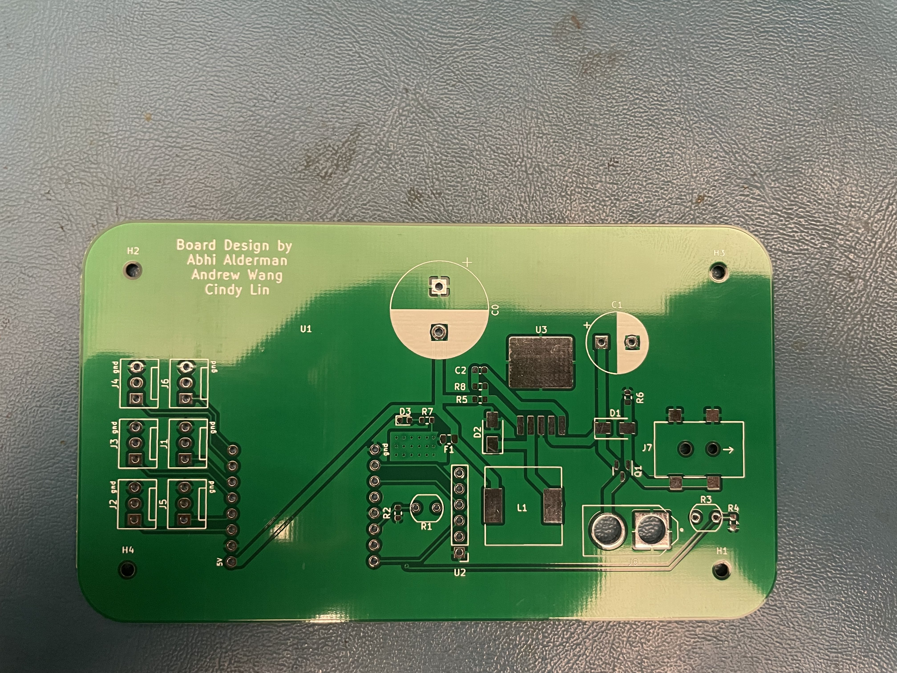

_Soldered Circuit Board_
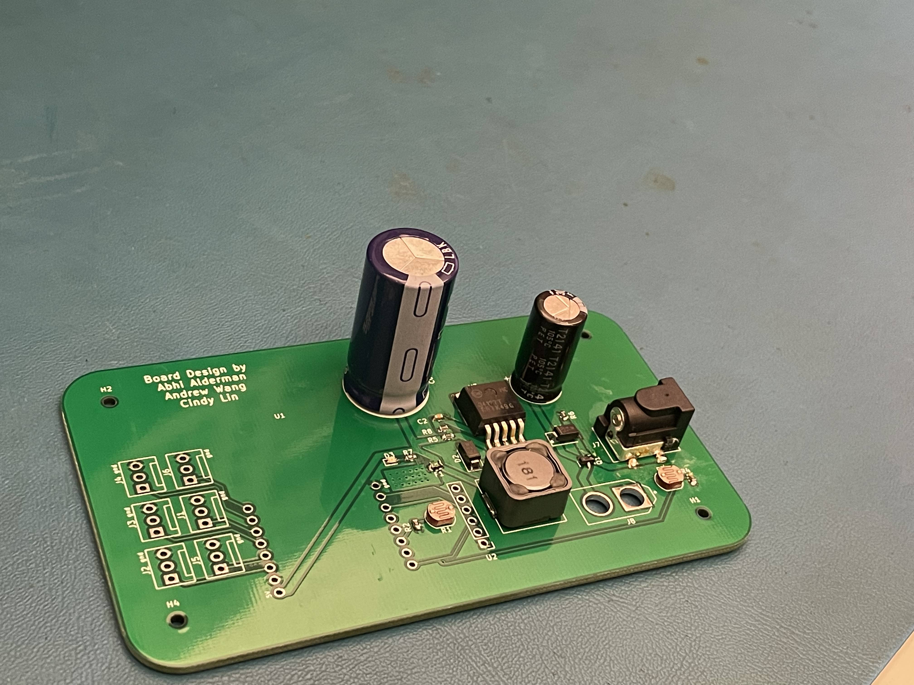

## **_Creating the eyes_**
The next step was to create the physical eyes that would be watching the face. We did this by 3d-printing a pair of eyes, equipped with eyelids and small control arms to control the rotation and blinking of the eyes. Servos were then attached to these control arms. My project partner, a Mechanical Engineering major, did the leg work for this part of the project, and I think he did a great job.

_Printed eyes front view_
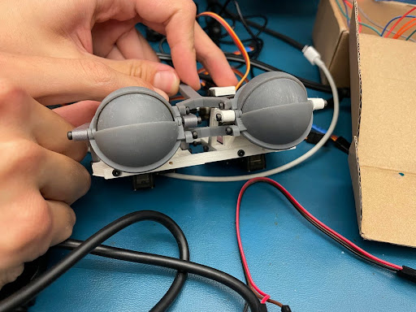

_Printed eyes top view_
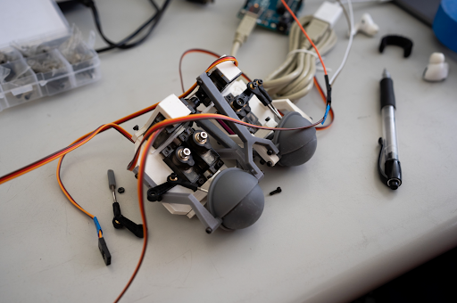

_Making the eyes blink_
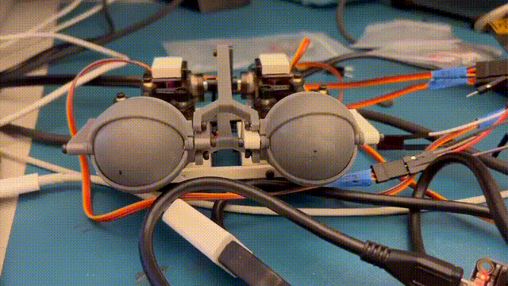

## **_Detecting faces and controlling the eyes_**
Next comes the software. We used an ESP32-CAM for this project, because it came equipped with a small camera we could use, and it had facial recognition software easily available. The first challenge I faced was getting connected to the ESP32 at all to actually control it. My first approach was to connect the ESP32 to the school WiFi, and use that to connect to it on my laptop to control everything. This proved to be too unstable and slow, probably because of the quality of the school WiFi. The solution was to turn the ESP32 into an Access Point that I could connect my Laptop to directly. Then, we could use the built in libraries for facial recognition to easily detect and track faces. These libraries gave us the x and y coordinates of the face relative to the screen, and by using some math we could use these coordinates to make the servos point towards those coordinates. This let our eyes detect and look at a face.

_Web server interface for the ESP32 Camera_
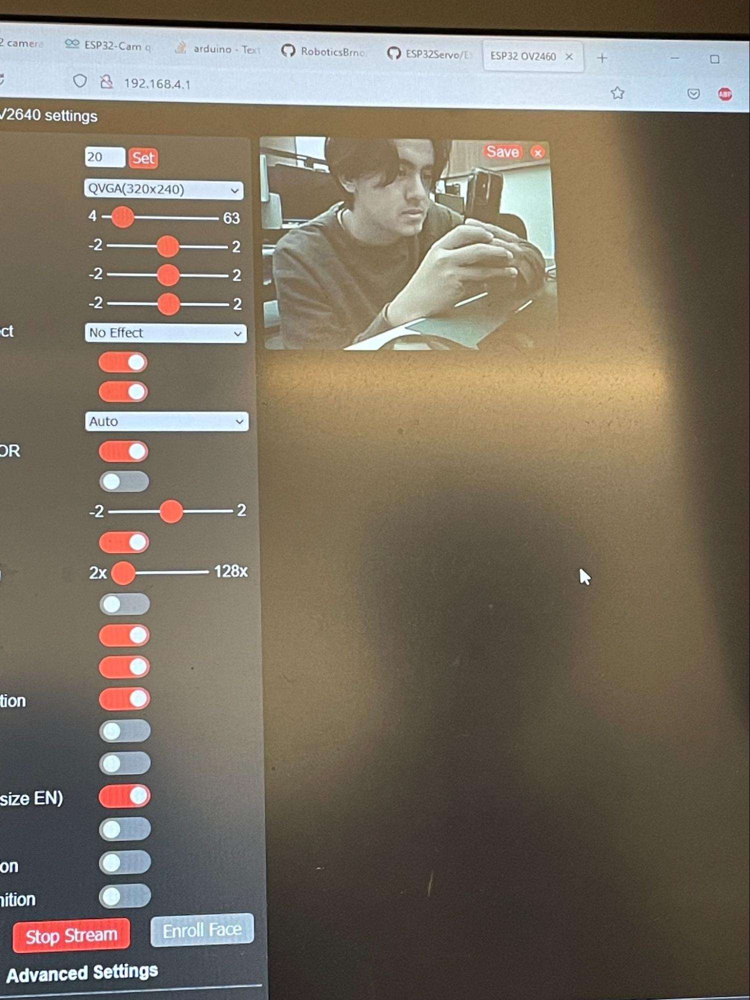

_Connecting to the ESP32 as an access point_
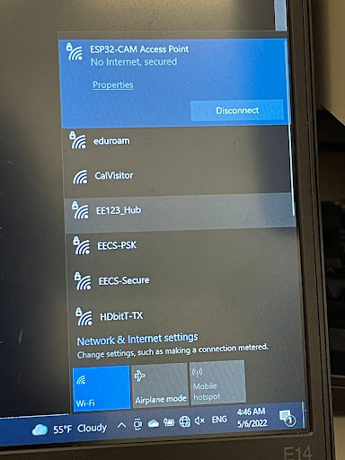

_Live camera feed_
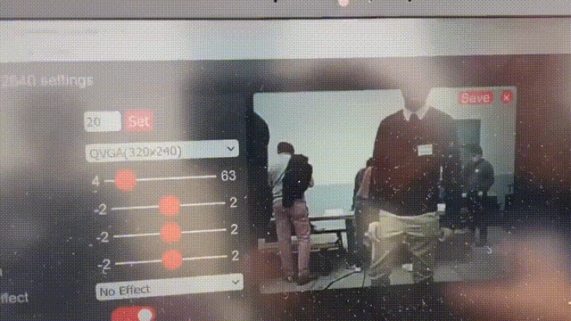

## **_Putting it all together_**
The final step was to house our new creation, which we lovingly named Jeffrey after our favorite teaching assistant. Being on a time crunch, we just stuffed Jeffrey into a cardboard box. This ending up working great for us, as it kept the eyes stable, made for easy wiring, and allowed us to mount the ESP32-CAM. 

_Final Assembly_

_Top View_
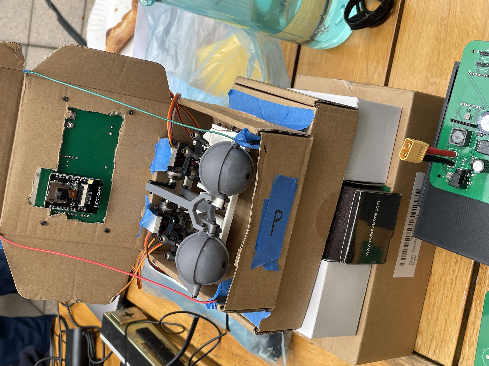

## **_Completion_**
Overall, I would consider this project a success. The main challenges were designing the PCB schematic, finding the correct electrical components, learning how to properly use the ESP32, and getting the eyes to accurately follow a face. We were able to overcome all of these, and get a working design. However, there was still room for improvements. The biggest flaws were the time-delay for the eyes to follow a face, and the unused photoresitors. We wanted to use photoresistors to detect light, and automatically have the eyes close if a light was pointed directly at them. We had to scrap this idea, as the I/O ports we needed to use the photoresistors were already being used by the camera. For the face tracking, there was a noticeable delay between a face appearing, and the eyes tracking it. It was not able to follow a face in real time as we had hoped, due to too many small delays, lag, and complications throughout the whole face following process. To solve this, I think we would need to further optimize the face coordinate to servo movement algorithm, and improve our network connectivity speeds. Besides these flaws, I was overall very pleased with how the project turned out, and it remains one of my favorite projects I have worked on.