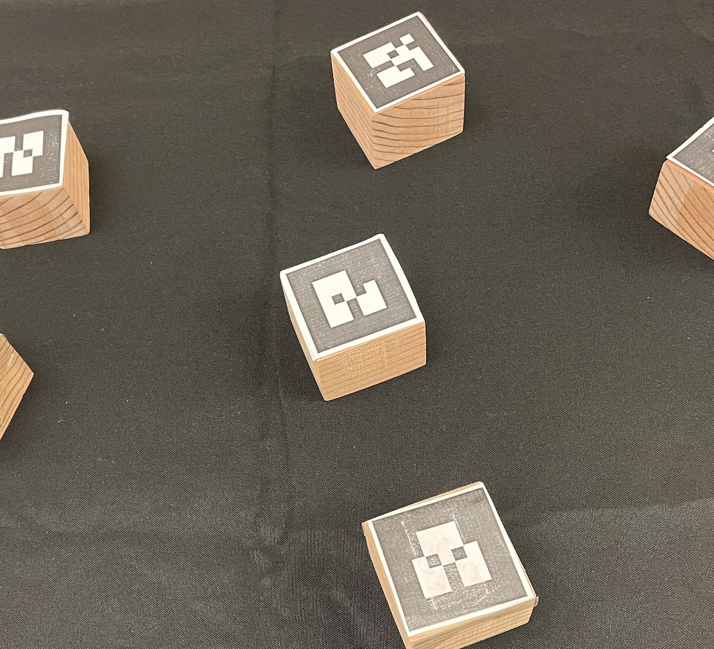
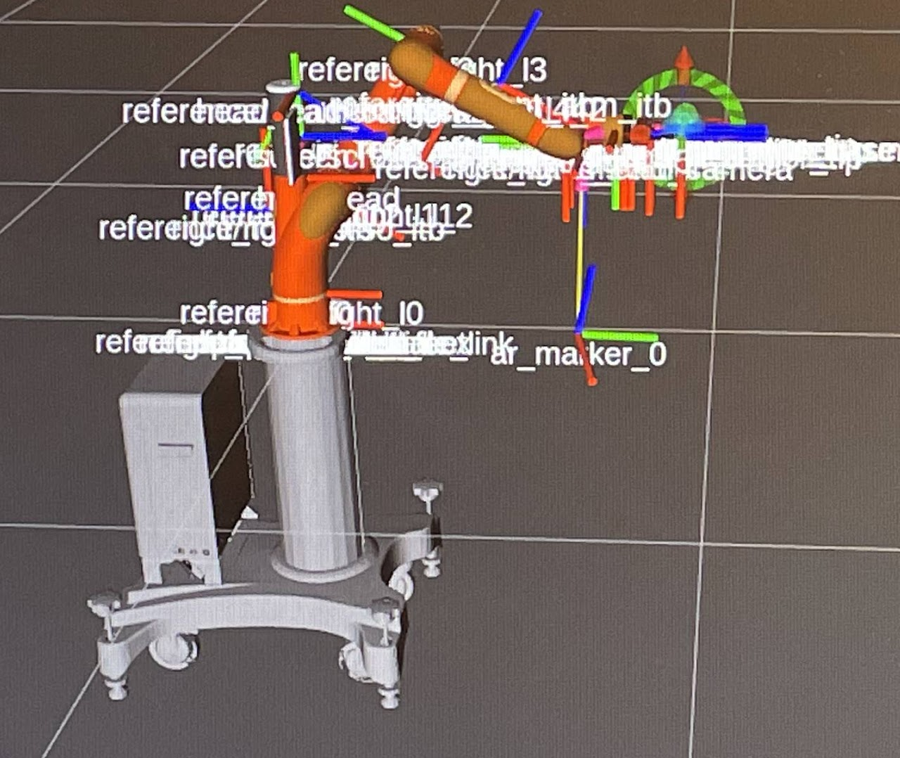
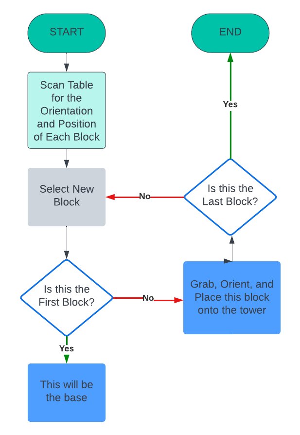
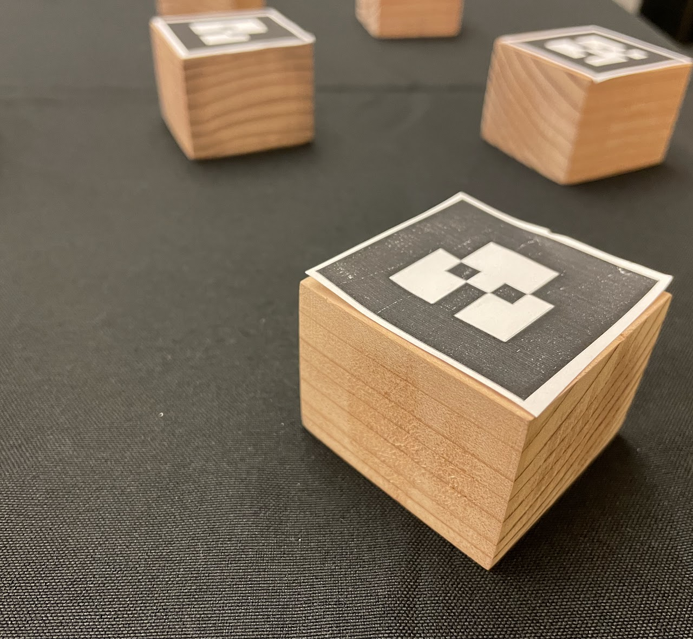
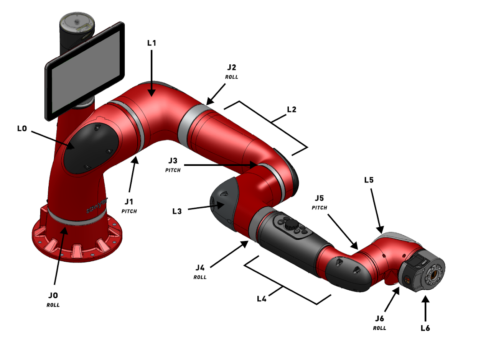
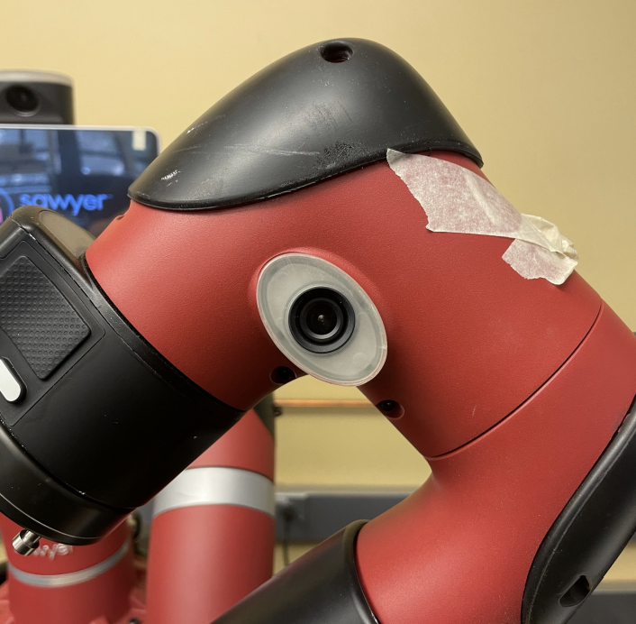
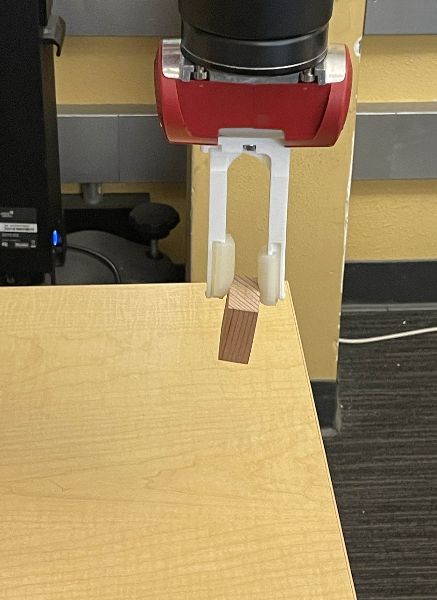
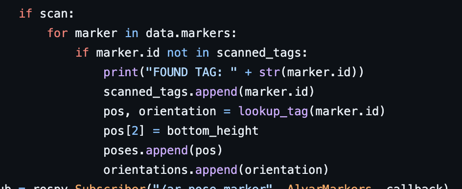
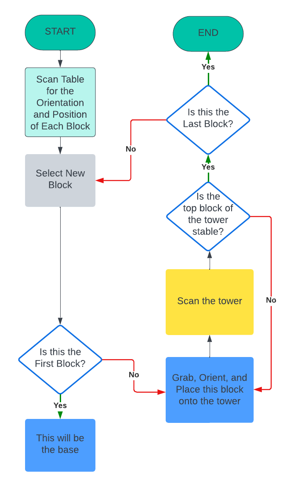
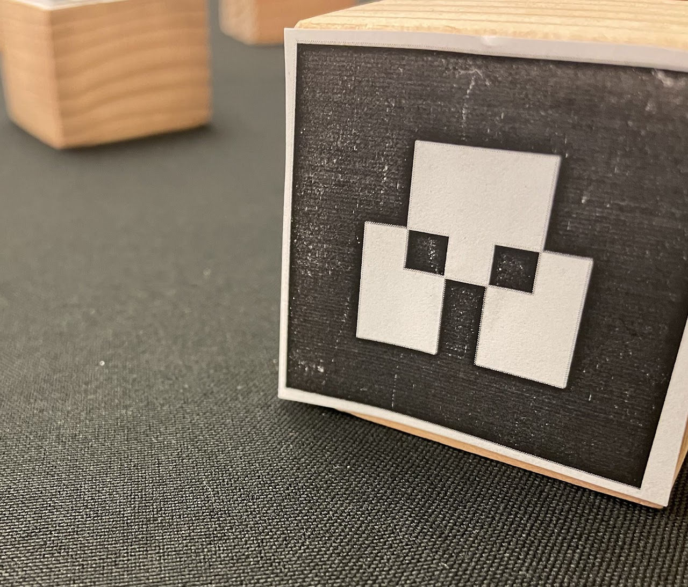

The **Final Project Submission Webpage** link will take you to the web page we submitted as the final portfolio for this project, which gives an in depth overview of this project's design and implementation, with visuals. I recommend checking that webpage out for all the information on this project, as it is laid out nicely. This page will simply be a rehash of the information presented there.
***
# **Overview**
***
Our goal was to use a Sawyer Robotic Arm to build a tower using square blocks. We attempted to implement a feedback system that would ensure that each block was placed in an adequate position, within some small tolerance, to help stabilize the tower.

In this project, we implemented the skills we learned in Labs (computer vision, path planning, controls,  etc.) Its success can be mirrored to real-world applications such as stacking boxes of products on pallets within major distribution centers. 

We figured this would be an interesting project to implement as we envisioned this being an extension from what we learned throughout the labs. 

## _Real world example_

 

## **_Sensing_**
Using the wrist arm camera, we were able to scan our playing field and record the position and orientation of any AR taf within view. This same camera also played a roll in ensuring accurate stacking and aided in adjustment calculations when blocks were placed incorrectly.

## **_Planning_**
- We used AR tags from each block to determine the orientation of the end effector and angles of each sawyer arm joint and do pick-and-place (stacking)
- Using the most recent AR tag to find the square error compared with the AR tag of the first block to ensure stable stacking 

## **_Actuation_** 
Using PID controller to efficiently do pick-and-place. Implemented learning system which allowed for more precise stacking. Using both our sensing algorithim as well as our PID, we reset the robot above the current stack to calcualte error of stack to decide whether corrections would be made or not. 

***
# **Initial Design**
***

Our project consists of three main components.

1) **Block Scanning:** Scan the AR tags on the blocks to determine the position and orientation of each block relative to the robot arm.

2) **Robot Control:** Use the found position and orientation of each block as the target for the robot arm to move to.

3) **Hardware:** Blocks for the Robot Arm to pick and place. AR Tags for the Camera to scan.

## **_Block Scanning_** 

## _Blocks with AR Tags_

A goal we established very early on was to have our camera accurately scan blocks to identify both their position and their orientation. Initially, we wanted to use blue 3D-Printed blocks and use color sensing to find the positions of the blocks. However, this was not enough for our project, as the position we got was not entirely accurate, we could not get the distance from the block to the arm using color alone, and we could not identify the orientation of the block very well. Things got especially bad when blocks were placed together, which was an avoidable part of our project, so we scrapped the color idea entirely and switched to AR Tags.

Using AR Tags, we could easily scan the AR Tag for each block and receive information about its position and orientation. We started by scanning the whole table, but this proved to be a problem, as explained further in the Implementation section.

## **_Robot Control_** 

## _ROS Robot axis setup_ 

### _Robot Controller_
We opted to use a PID controller rather than using inverse kinematics or strictly a feed-forward controller. We thought this would result in better control over our robot, and better movements between positions. However, we had to make some changes for our final design.

### _Main Controller Logic_

Our initial control loop was very simple. We simply wanted to pick a block, place it on the top of the tower, and repeat, until all blocks were placed. However, this did not work as well as intended. If all blocks were luckily able to be placed steadily as the tower was built, all worked well. But in the real world this rarely happened due to robot error, block slippage from the grip, friction, etc. So we had to make changes for our final implementation to work.

## **_Hardware_** 

### **_Blocks and black cardboard paper_**
The wooden blocks were manufactured from scrap wood using a wood saw machine and a sanding machine. Different dimensions were tested and eventually, 5 x 5 x 3.8 cm3  blocks were selected (optimal size for detecting and picking). Originally we started off with 3D printed blocks, however, we realized that the material for these blocks was rather slippery and not suitable for the Sawyer gripper and this, along with the color sensing issue mentioned before, ultimately pushed us to make the change to wooden blocks.

AR tags were generated from the ROS ar_track_alvar package. They store real-time geometry messages (positions and orientations). We tested different ways to place the AR tags on the blocks and eventually, we put tape in between the tag and the block to ensure that no glare would be present to affect the wrist camera's visibility.

Black cardboard paper was also used to enhance the arm's visibility (larger contrast between the tags and the background).

### **_Rethink Sawyer Arm_**

Used the provided Sawyer arm in the lab room, with an attached electric parallel gripper.

## _Sawyer arm_

## _Head camera and wrist camera_

## _Electric Parallel Gripper_

***
# **Implementation**
***

## **_Robot Controller Implementation_** 
Initially, we strictly used a P, I, and D constants for our PID controller, as usual. However, we found that the movements of the Robot Arm itself came out very slow. We tried updating the PID values, but this wasn't enough. Instead, we added the feedforward controller to our PID controller as well, so our final implementation used a FPID controller. This helped a lot with speed and accuracy. In the end, with some PID value tuning and the feedforward controller implemented, we were able to make our robot accurately move to desired positions.

## _Incorrect tuning causing a bad grip_

## **_Scanning Implementation_** 

Our initial idea was to scan the entire table from a high point of view. This did not work, as from such a far distance the camera on the robot arm was not able to properly scan and identify the AR Tags. We tried moving the arm closer, however while this allowed the blocks to be scanned, we could now only see a small portion of the table. So we had to make some changes.

### **Block Scanning Setup**

Prior to scanning our blocks, we had to find optimal positions to position the Sawyer arm such that we would be able to maximize the efficiency of the wrist camera for the AR tag scanning procedure. To this end we:

1) Zero g'd the Sawyer arm to allow for free movement and moved it to a desired position above the table 

2) Once we were in agreement with the position we then obtained the position using rostopic on our local terminal

3) We then created a custom launch file for each of three scanning positions 

### **Block Scanning Process**

Afterwards, we embed these custom scanning positions into our code and our process, while simple, was as follows:

1) Control the Sawyer arm to move to the left, middle, and right desired positions all the while scanning any ar tags within view 

2) For every tag that our wrist camera would capture, we would then use the lookup_tag() function to extract the position and orientation of this AR tag and save this information, along with the AR tag identifier, into a global list of "seen" AR tags. 

## **_Main Logic Implementation_** 

As mentioned in the Design section, our initial idea for the control logic was too simple and did not work properly due to the errors of the real world. Oftentimes, when placing the block onto the tower, the block would be placed in such a way that any blocks placed on top of it would end up toppling the tower. This was because of the small errors that could occur in both the pick up and placing phase of the robot. If a block was picked up at a weird angle, or placed in such a way that the grippers cause it to shift on top of the tower, it could end up very off center from the desired position. We tried to make our pick and place as accurate as possible, but these small errors would add up and make our tower topple before it could gain any substantial height.

For our final implementation, we wanted to make sure the tower remained stable as it was built. To do this, we changed our control loop to make sure we scanned the tower whenever a new block was placed. We could then determine, based on this new block's position and the desired position, whether this block was not stable. This allowed us to re-stack blocks that would otherwise result in an unstable structure. Illustrated is the final control loop for our program, with each step labeled.

## _Final Logic Flowchart_

## **_Hardware Implementation_** 
Our project did not rely on much hardware outside of what was already available in the Lab. We mainly utilized the Sawyer arm along with the camera already present on the sawyer.

The only necessary hardware were the wooden blocks along with the AR Tags to use as blocks to stack. As mentioned in our Design page, we originally wanted to use blue 3D-Printed blocks to stack. We were going to rely on color sensing to detect our blocks as well, but this proved to be too inaccurate. We also found that when picking and placing the 3D-Printed blocks, the plastic material made the blocks slightly slippery, which caused some attempted pick ups to drop the block entirely.

***
# **Results**
***

Although we weren't able to get a zero error model, we were still satisfied with our end product and what our system was able to achieve. From constant toppling to 90% accuracy, this was a big win for us. 

In the end, our system was able to: 

_1) Use the Sawyer wrist camera to perform a scan of the playing field at 3 locations and identify/record any AR tag positions and orientations it is able to find._ 

_2) Using these recorded positions and orientations, our system would then use transformations to calculate and determine the required angle and orientation to pick up the next block._

_3) Upon picking up and placing the next block, our system would then enact our feedback system to ensure that the block is placed at an adequate position to ensure the stability of our tower._

***
# **Conclusion**
***
In the end, we were able to satisfy a many of our design constraints including: 

- _Effective block-stacking algorithm capable of maintaining stability_

- _Effective path planning and trajectory tracking using our Linear Trajectory controller_

- _Safe movement of the Sawyer robot using our PID controller_

- _Successful use of our feedback system to re-align blocks if necessary_

## **_Difficulties_** 

Throughout our project, we faced a wide set of difficulties including:

- Determining a suitable height to drop the block as to not accidentally knock over the tower in the process

- Grabbing the next block to pick up at a proper orientation from the sides of the block rather than the corners

- Large time delays between Sawyer movements

- Determining good tolerance values for the PID controller as well as good error values

- Inadequate lighting also led to faulty readings when the wrist camera attempted to scan the AR tags on top of our block 

## **_Improvements_** 

Although we were happy with our results, there were some things we would change. If we were given more time to work on this project, we propose the following improvements:

**1)** Using blocks with different shapes to build towers with various input dimensions 

**2)** The use of a pneumatic suction actuator to enhance accuracy and efficiency of pick-and-place, and allow us to place blocks directly next to each other to form some sort of pyramid shape.

**3)** Rather than simply re-picking and re-placing the top block when the tower is misaligned, it would be more efficient to recognize in what way the tower is misaligned, and to move appropriately.

**4)** Matching the orientation of the block itself rather than the AR Tag. This would allow us to pick the block more quickly, rather than rotating to an unnecessary position (ex: rotating to 180 degrees instead of 90 degrees, when both rotations work for a square block).