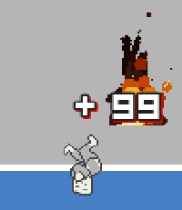
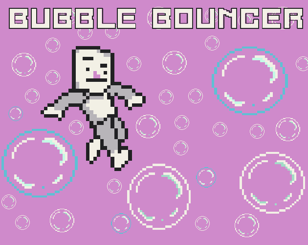

Simple game jam game I made in godot in 3 days. My first solo attempt at a video game, purely for entertainment and learning on my own time. Bounce on bubbles while avoiding obstacles to get a high score. Give it a try! Runs on the browser on itch.io.
# **_UNDER CONSTRUCTION_**
I am still working on this page. Sorry! This should be complete by tomorrow, 3/28/25. Check the links for more info. Feel free to message me at abhialderman@gmail.com if you have any urgent questions.

***
## **_Temporary Visuals. Description to come later_**

.png)

.png)

