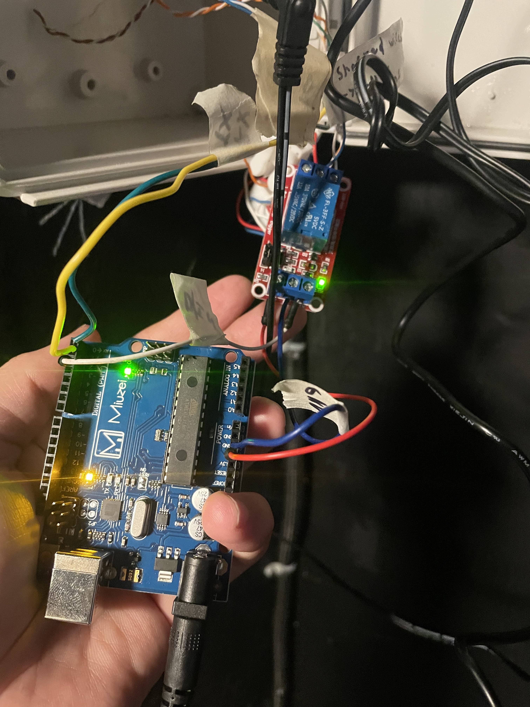
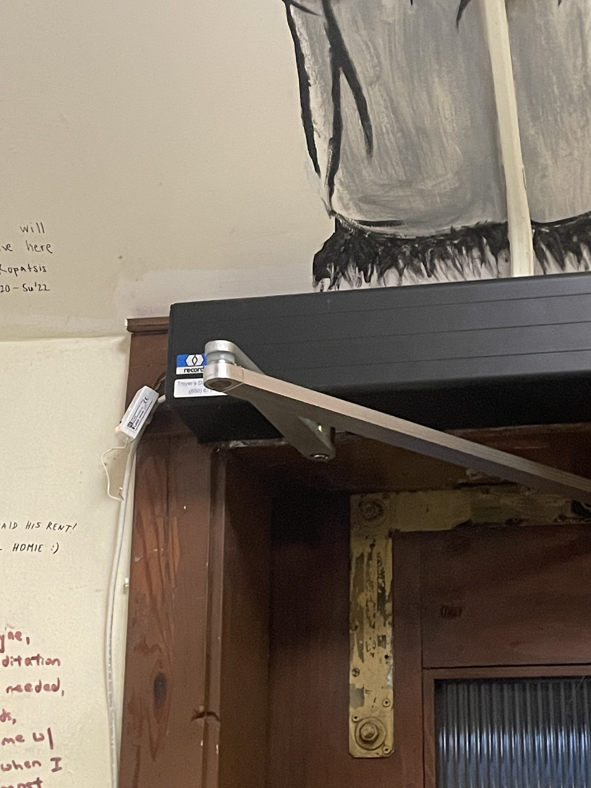

As Network Manager, I automated the front door at Cloyne Court, the Berkeley Student Co-Op I lived at. The end program for this is pretty simple and runs on arduino, but debugging this was a very difficult challenge for myself and Benedict (My co-manager). It took us a while to learn how the returned Hexadecimal data from the RFID scanner corellated to the student ID of the card that was scanned. Figuring that out made the rest easy. To open this door, you must be a UC Berkeley student with an ID card, and you must be verified as living at cloyne court. The verification process was simple sending part of the digits on the back of the ID through a google form, where the Network Manager can see it and add it to the verified list of IDs. 
# **_UNDER CONSTRUCTION_**
I am still working on this page. Sorry! This should be complete by tomorrow, 3/28/25. Check the links for more info. Feel free to message me at abhialderman@gmail.com if you have any urgent questions.

## **_Arduino electronic setup_**

## **_Door opener_**
