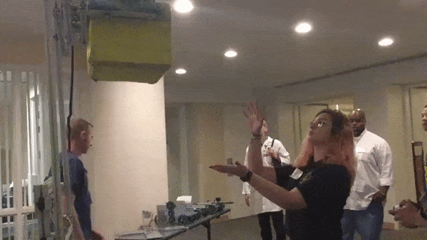
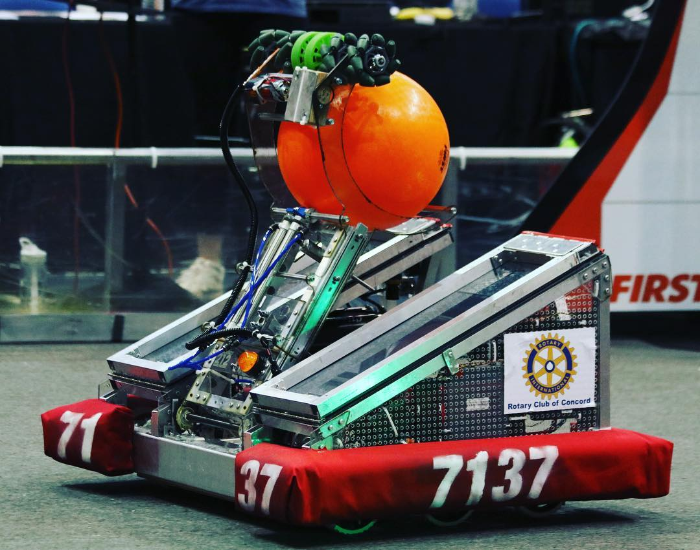
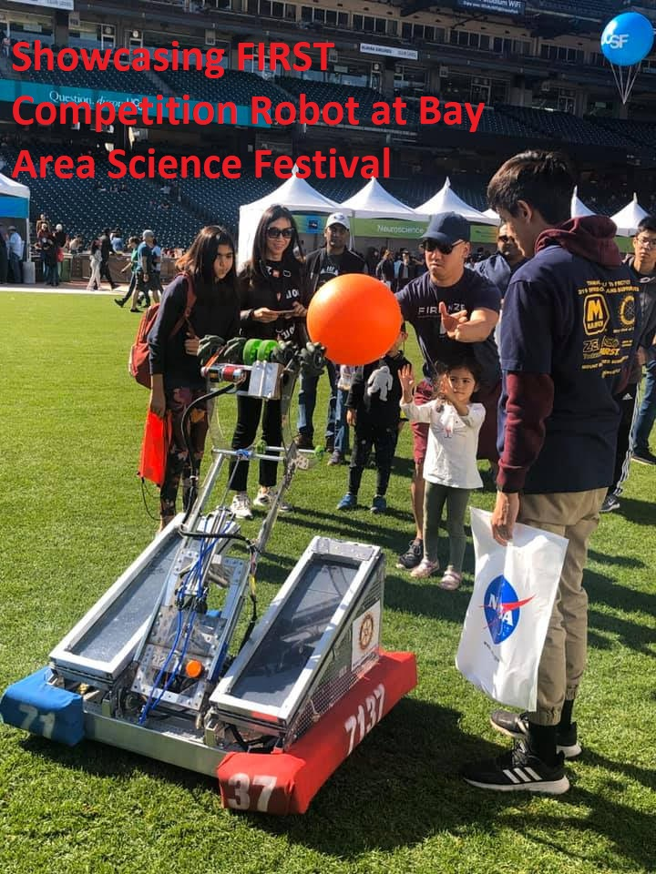
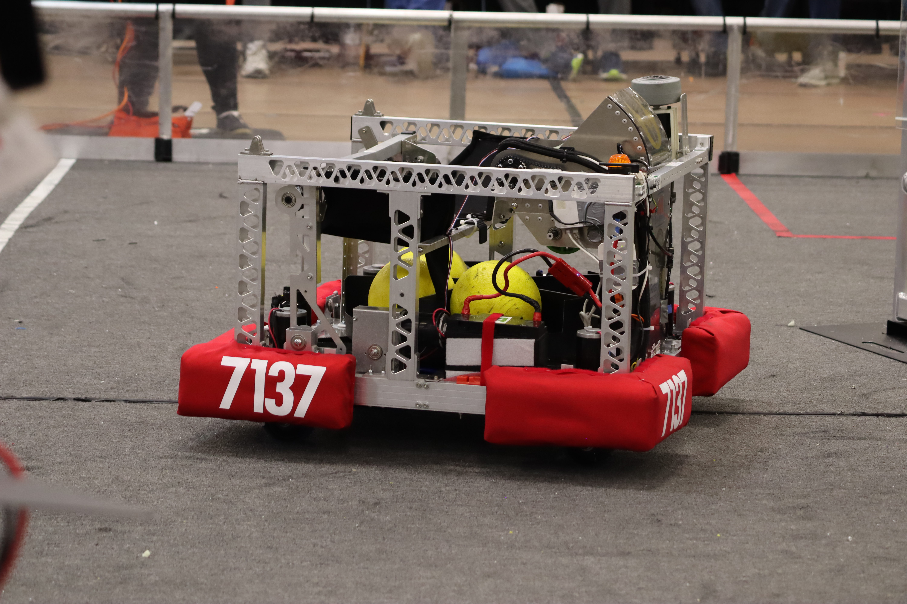

***
# **Summary**
***
From 2018 - 2020, I was in the Ygnacio Valley High School Robotics Club. Starting in 2018, we got the change to compete in the yearly FIRST Robotics Competition with other high schools. This was my first introduction into both robotics and software as a whole, and I couldn't have asked for a better first experience. This page will have a quick summary of each year, with some cool visuals.

***
# **2018**
***

Our first year as a club. This was a difficult but informative year for all of us, as we were all learning what it takes to build a robot. I worked on the software side with one another student, programming the robot in the LabVIEW language. We competed in the San Francisco Regional Competition, and were lucky enough to win the **Rookie All Star Award**. This gave us the opportunity to compete in the Championship in Houston. It was a great learning experience and loads of fun.

## **_Grabbing the game object_**

## **_Shooting the game object_**

## **_Full range_**

***
# **2019**
***
After having experienced our first year creating a robot, this year went a lot smoother. We were able to get up and running a lot faster, and had a robot done sooner than we had before. I was the Lead Programmer and the Vice President, which gave me many more responsibilities. This was my first year using an Object Oriented Programming language, as we had switched to Java. We competed in the Monterey Bay Regional, and performed **absolutely horribly**. There were many issues with our robot, including network connectivity, hardware failures, and design failures. We placed **second to last** overall. We had another opportunity at the Davis Regional, which gave us time to make improvements to our robot. These improvements proved fruitful, as we were able to make it to the **Semi-Finals** at the Davis Regional. Our performance was much better overall thanks to our improvements to the design and addressing our issues, and I'm proud of how we bounced back as a team.

## **_Our 2019 Robot Final Design_**

## **_Showcasing our robot at the Bay Area Science Festival_**

## **_Robot Demo_**

***
# **2020**
***
My Senior year of high school. Before Covid, we got the opportunity to build and compete in a competiton, as this took place very early in the year (January - March). I was President this year, and also performed the majority of the programming. We were able to get up and running the fastest this year due to our experience, but we face challenges with our design. We switched to a differential drive train, which proved to be a coding nightmare. I was not able to get a fully optimized program running for our drive, and our final design definitely had some strange quirks. For this reason I was the Driver at the competitions as well, as I knew best what **not** to do with the controls, and could avoid running into the different control errors. Overall, this year was a good experience as well. I really enjoyed the game itself this year, as we were able to collect and shoot many small foam balls at a time, which was very fun. I also got to dabble in computer vision a bit, using the retroreflective tape on the field to try and auto-aim our robot towards the goal. Even though our season was cut short by Covid, I would still consider this year my favorite, as this was the most complicated robot I ended up working on during my 3 years.

## **_Our 2020 Robot Final Design_**

## **_Testing the Shooting Mechanism_**

## **_Trying to shoot into a basketball hoop_**
