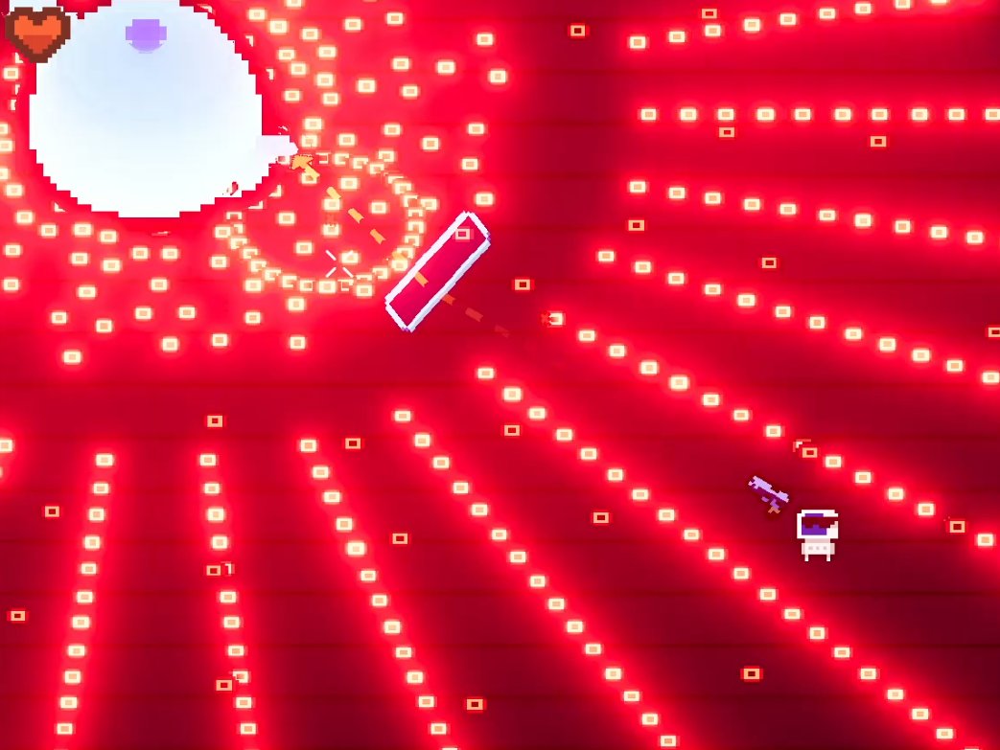
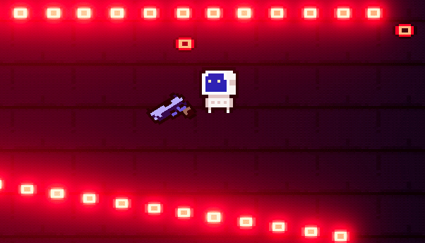
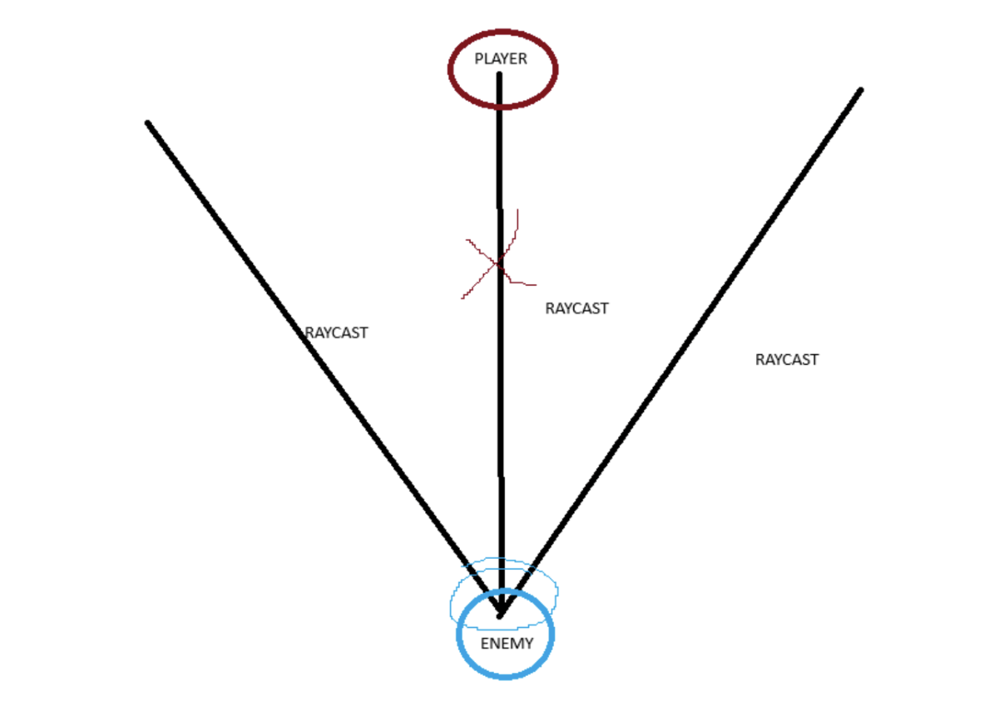
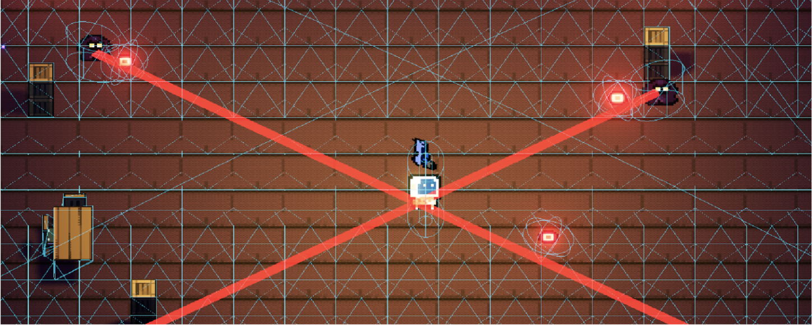
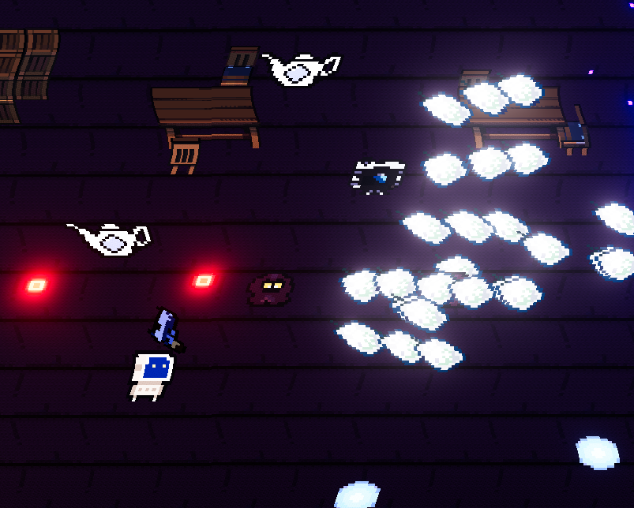
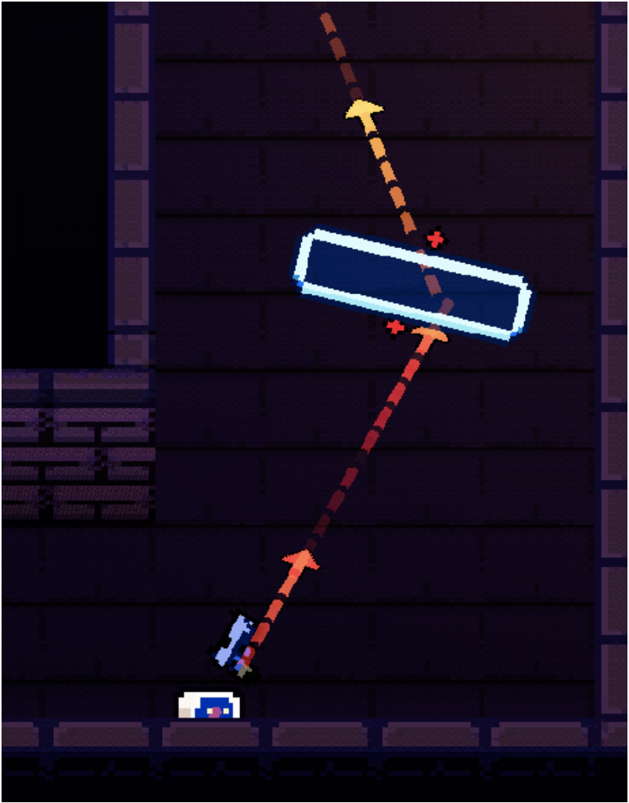
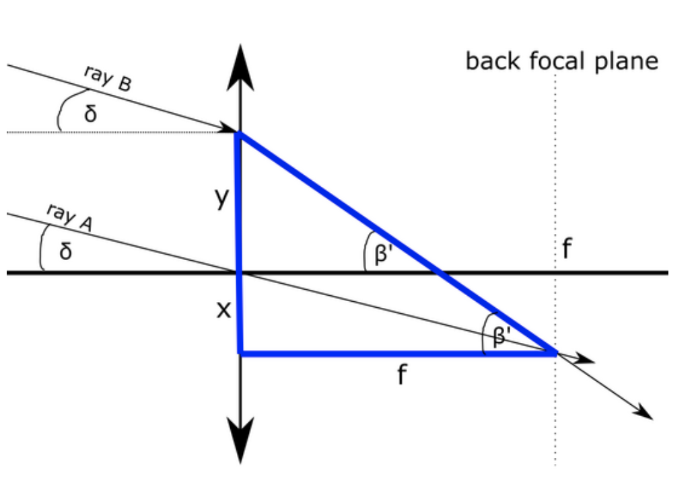
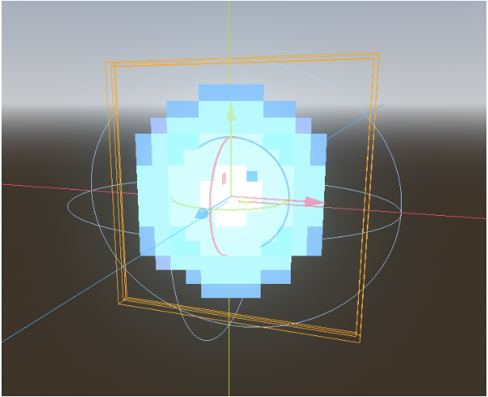
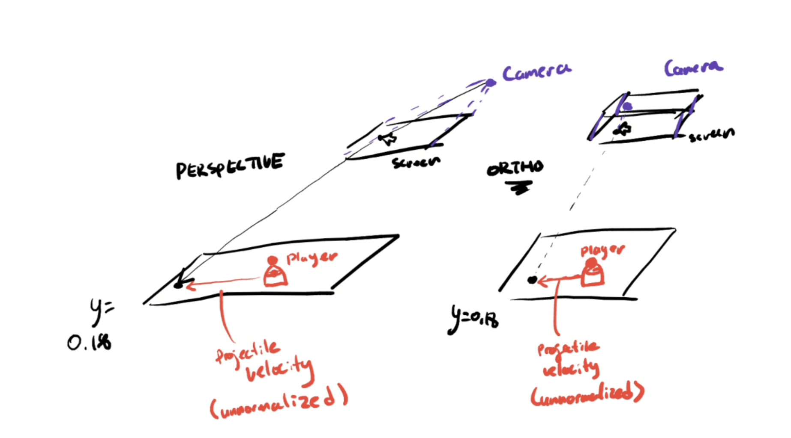

Final project for my computer graphics class at UC Berkeley. The Class Project Webpage contains comprehensive info for this entire project. I will update this page with visuals in the future, for now please check out the Webpage to see the technical details. If you want to play the game, check out the itch.io page. Note that this game is a bit performance intensive, so it will not run well on browser and must be downloaded.
# **_UNDER CONSTRUCTION_**

***
## **_Visuals. Description to come later_**

