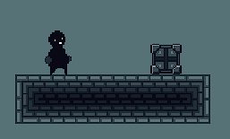
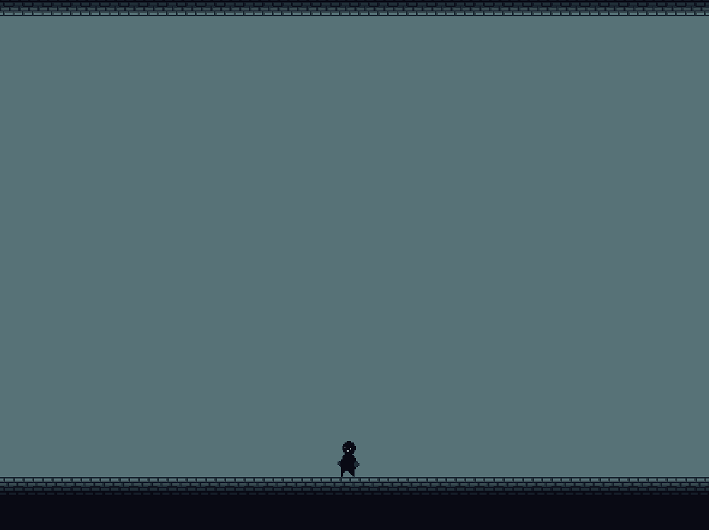
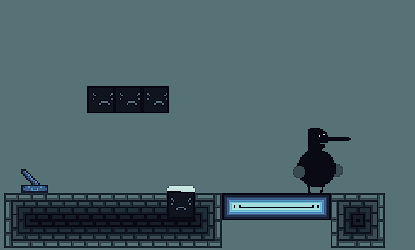
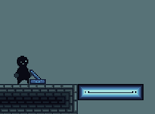
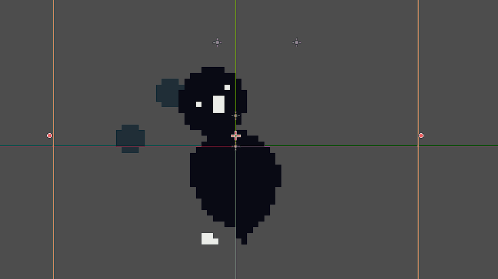
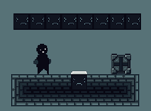
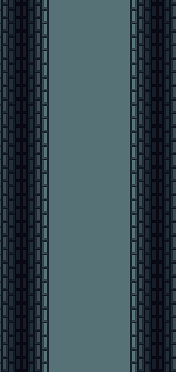

Game jam game I made in godot over 2 weeks with some friends for the 2024 Pirate Software Game Jam. I worked on the programming and implementation, and got help from some friends for all the required assets and playtesting. Give it a try! Runs on the browser on itch.io.
***
# **_UNDER CONSTRUCTION_**
I am still working on this page. Sorry! This should be complete by tomorrow, 3/28/25. Check the links for more info. Feel free to message me at abhialderman@gmail.com if you have any urgent questions.

***
## **_Visuals. Description to come later_**

