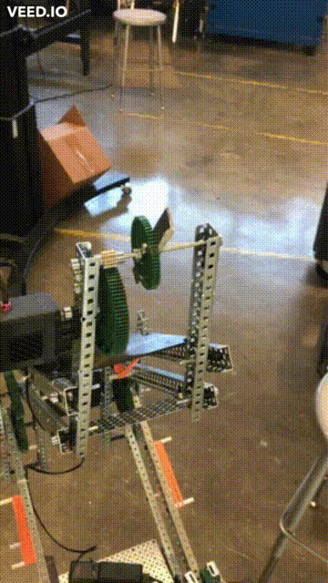
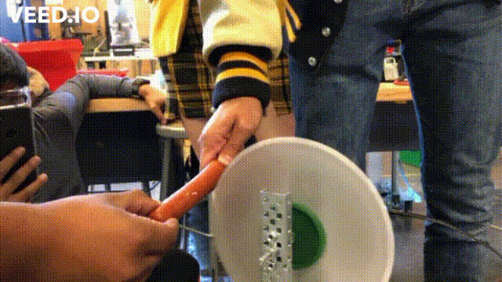
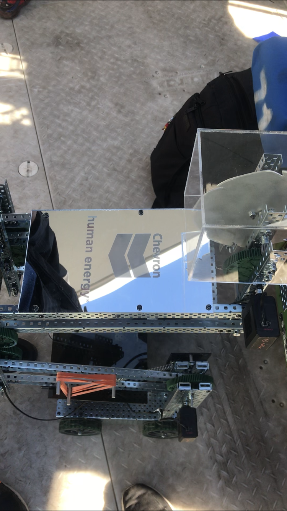

Small robot I made for the Bay Area Science Festival. My high school robotics club was asked to make some kind of robot or engineering-related design to cut the ribbon to start the festival off, and I was given the opportunity to develop this. Myself and 2 others were given time during some of our classes to work on this robot. We had a simple 4 wheel drive train, with an attached custom-made sawblade that was spun at high speeds to cut through the ribbon like butter. This saw was lifted usng a Reverse Double 4-Bart lift. Overall, this project was super fun, and remains one of my favorite projects to have worked on, even all these years later.
***
# **_UNDER CONSTRUCTION_**
I am still working on this page. Sorry! Check the links for more info. Feel free to message me at abhialderman@gmail.com if you have any urgent questions.
***
## **_Prototype lift and saw_**

## **_Testing a new custom saw on a sausage_**

## **_Final Design_**

## **_Cutting the ribbon_**

